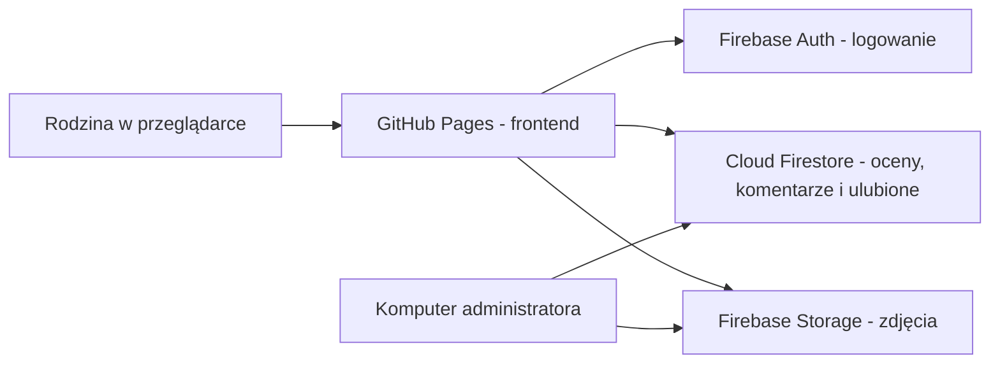

# Frame

**Rodzinny wybór zdjęć bez arkuszy, wiadomości i zgadywania nazw plików.**

Frame pomaga pięciu osobom niezależnie przejrzeć zdjęcia z rodzinnej sesji, wystawić oceny,
zaznaczyć ulubione i omówić kadry. Administrator otrzymuje wspólny ranking oraz gotową listę
nazw plików do przekazania fotografowi.

[Otwórz aplikację](https://domindev.github.io/DominDev-Frame/) ·
[Sprawdź publikację](https://github.com/DominDev/DominDev-Frame/actions/workflows/deploy.yml)

> Dostęp do galerii i danych jest ograniczony do zaproszonych osób. Aplikacja nie udostępnia
> rejestracji; konto i hasło przekazuje administrator rodzinie.

## Dlaczego powstał Frame

Wybór kilkuset podobnych kadrów szybko zamienia się w serię wiadomości typu „to trzecie od
końca” albo kilka niespójnych list. Frame utrzymuje cały proces w jednym miejscu:

- każda osoba ocenia zdjęcia we własnym tempie;
- średnia nie sugeruje decyzji przed oddaniem własnego głosu;
- nazwa pliku pozostaje widoczna od galerii aż po raport;
- wyniki aktualizują się na bieżąco dla wszystkich zalogowanych osób;
- administrator może skopiować lub wyeksportować końcową listę bez ręcznego przepisywania.

## Jak wygląda wybór

1. Zaloguj się otrzymanym adresem e-mail i hasłem.
2. Przeglądaj galerię, wyszukaj fragment nazwy pliku albo wybierz **Oceniaj dalej**.
3. Odpowiedz oceną 1-5 na pytanie: „Czy warto wybrać to zdjęcie do obróbki?”. Ocenę możesz
   później zmienić lub usunąć.
4. Oznacz sercem zdjęcie, które na pewno chcesz do obróbki, albo zostaw wspólny komentarz.
5. Administrator porównuje ranking, liczbę głosów i ulubione wszystkich osób.

| Ocena | Znaczenie |
|---:|---|
| 1 | zdecydowanie nie |
| 2 | raczej nie |
| 3 | nie mam pewności |
| 4 | raczej tak |
| 5 | zdecydowanie tak |

Serce jest osobnym, mocniejszym sygnałem: „to zdjęcie na pewno chcę do obróbki”. Nie wpływa na
średnią ocen i pozostaje prywatne dla użytkownika oraz administratora.

## Najważniejsze funkcje

### Dla każdej osoby

- galeria wszystkich zdjęć z oryginalnymi nazwami plików;
- ocena 1-5 z możliwością późniejszej zmiany;
- średnia odsłaniana dopiero po własnej ocenie;
- prywatne ulubione widoczne również dla administratora;
- wspólne komentarze podpisane imieniem;
- wyszukiwanie zdjęć po pełnej nazwie lub jej fragmencie;
- filtry zdjęć nieocenionych, ulubionych i skomentowanych;
- dodatkowe filtrowanie po własnej ocenie i średniej;
- sortowanie po nazwie, średniej, liczbie głosów lub komentarzach;
- pasek postępu oraz przycisk **Oceniaj dalej**, otwierający pierwsze nieocenione zdjęcie;
- zmiana własnego hasła bez opuszczania aplikacji.

### Podgląd zdjęcia

- pełnoekranowy tryb skupienia z oceną, ulubionymi i komentarzami;
- zielona plakietka **Obrobione** w galerii, gdy dostępna jest gotowa wersja zdjęcia;
- czytelny wybór **Przed obróbką** / **Po obróbce** w panelu zdjęcia, bez zmiany ocen,
  ulubionych i komentarzy przypisanych do kadru;
- opcjonalna lupa podążająca za kursorem oraz dwa poziomy powiększenia całego obrazu;
- pasek narzędzi nad zdjęciem, który nie zasłania oglądanego kadru;
- smukłe paski przewijania powiększonego kadru na komputerze;
- powiększanie dwukrotnym dotknięciem i przesuwanie kadru palcem na telefonie;
- obsługa zdjęć poziomych i pionowych bez obcinania kadru;
- skróty `1`-`5` do oceniania, `←` i `→` do nawigacji, `F` do ulubionych,
  `L` do lupy oraz `Esc` do zamknięcia.

### Dla administratora

- postęp oceniania każdej osoby;
- ranking zdjęć według aktualnej średniej;
- oceny poszczególnych członków rodziny w jednej tabeli;
- filtrowanie wyników według minimalnej liczby głosów;
- raport ulubionych wraz z informacją, kto wybrał dane zdjęcie;
- kopiowanie samych nazw plików oraz eksport CSV;
- możliwość ustawienia nowego hasła dowolnej osobie lokalnym skryptem.

## Projekt doświadczenia

Frame jest narzędziem dla małej, znanej grupy - także dla osób nietechnicznych i starszych.
Dlatego interfejs korzysta ze znanych wzorców, prostego języka i dużych celów dotykowych.
Zdjęcia pozostają wizualnie najważniejsze, a elementy sterujące używają jednego, spokojnego
akcentu kolorystycznego.

Aplikacja obsługuje klawiaturę, widoczny fokus, preferencję ograniczonego ruchu oraz układ od
telefonu 320 px do dużego monitora. Otwarty podgląd blokuje galerię w tle, a komunikaty błędów
i stan braku internetu wskazują, co
użytkownik może zrobić dalej.

Szczegółowe zasady produktu znajdują się w [PRODUCT.md](PRODUCT.md), a pierwotne decyzje
architektoniczne w [specyfikacji projektu](docs/specs/2026-08-04-frame-design.md).

## Architektura

Frontend jest statyczną aplikacją React publikowaną na GitHub Pages. Logowanie i wspólne dane
zapewnia Firebase, dzięki czemu projekt nie wymaga własnego serwera.



- **Frontend:** React, TypeScript, Vite i CSS Modules.
- **Usługi:** Firebase Authentication, Cloud Firestore i Firebase Storage.
- **Hosting:** GitHub Pages z automatycznym buildem w GitHub Actions.
- **Nawigacja:** hash routing zgodny ze statycznym hostingiem w podkatalogu.

Zdjęcia nie trafiają do publicznego repozytorium. Manifest z ich adresami jest dostępny dopiero
po zalogowaniu, a reguły Firestore ograniczają zapis ocen i ulubionych do ich właściciela.

## Uruchomienie lokalne

Wymagane są Node.js i npm. Konfiguracja klienta Firebase znajduje się już w repozytorium - jak
w każdej aplikacji webowej nie jest tajnym kluczem; dostęp do danych kontrolują reguły Firebase.

```powershell
git clone https://github.com/DominDev/DominDev-Frame.git
Set-Location DominDev-Frame
npm ci
npm run dev
```

Vite pokaże lokalny adres aplikacji. Wariant odpowiadający produkcji uruchomisz tak:

```powershell
npm run build
npm run preview -- --host 127.0.0.1
```

Następnie otwórz `http://127.0.0.1:4173/DominDev-Frame/`.

## Kontrola jakości

```powershell
npm run typecheck
npm test
npm audit --omit=dev --audit-level=moderate
npm run build
```

Workflow publikacyjny wykonuje te same kontrole przy każdym pushu do `main`, a dopiero potem
wdraża artefakt na GitHub Pages.

## Obsługa zdjęć i kont

Skrypty administracyjne wymagają pliku konta usługi w
`%USERPROFILE%\.frame\service-account.json`. Plik pozostaje poza repozytorium.

```powershell
# Przygotowanie miniatur i wersji pełnych z plików umieszczonych w _source/
npm run photos:prepare

# Wysłanie zdjęć do Storage i zapis manifestu
npm run photos:upload

# Kontrola mapowania zdjęć po obróbce bez zapisu i bez wysyłki
npm run photos:edited:check -- --source "D:\katalog\ze-zdjeciami"

# Przygotowanie miniatur i wersji pełnych po akceptacji mapowania
npm run photos:edited:prepare -- --source "D:\katalog\ze-zdjeciami"

# Podgląd planu wysyłki bez zmiany Firebase
npm run photos:edited:upload

# Wysłanie zdjęć po obróbce i bezpieczne scalenie osobnego manifestu
npm run photos:edited:upload -- --confirm

# Lista kont
npm run user:password -- --list

# Ustawienie nowego hasła
npm run user:password -- <adres-email> <nowe-haslo>

# Kontrola konfiguracji i reguł Firebase
npm run verify:firebase
npm run rules:verify
```

Katalogi `_source/`, `_processed/`, `_edited_source/` i `_processed_edited/`, zdjęcia, hasła
oraz klucz konta usługi są wykluczone z repozytorium.

## Struktura projektu

```text
.github/workflows/   automatyczny build i publikacja
docs/specs/          specyfikacja i decyzje architektoniczne
scripts/             zdjęcia, konta, Firebase i testy
src/components/      interfejs pogrupowany według funkcji
src/hooks/           stan aplikacji i synchronizacja danych
src/lib/             logika domenowa i integracje
src/styles/          globalne style i tokeny wizualne
```

## Publikacja

Push do `main` uruchamia workflow **Publikacja na GitHub Pages**. Po przejściu kontroli typów,
testów, audytu zależności i buildu nowa wersja zostaje udostępniona pod adresem:

**https://domindev.github.io/DominDev-Frame/**
